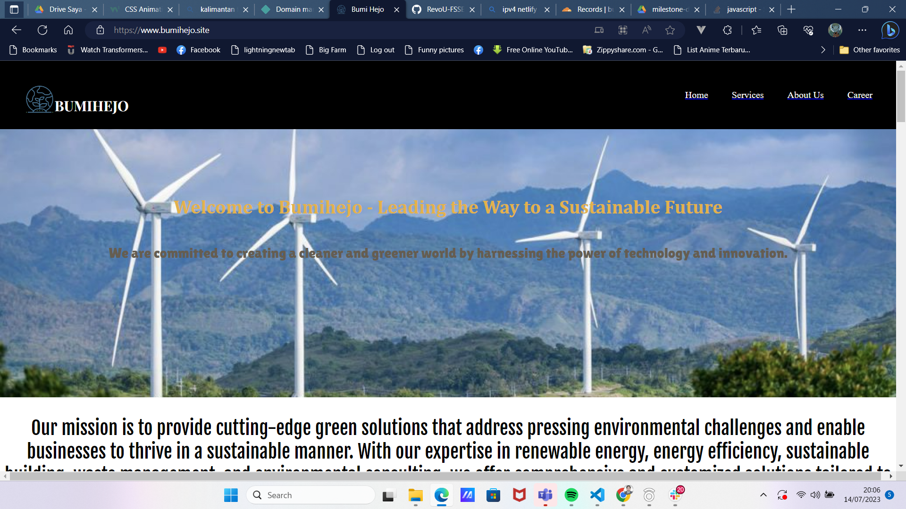

[](https://classroom.github.com/a/f6dTnkNL)
# TUGAS WEEK-5 (FRONT END PROJECT)
Pada tugas ini ditugaskan untuk membuat website company profile dengan HTML,CSS, dan Javascript. Hal-hal yang diwajibkan antara lain:
1. Semantic HTML
2. Documentation with REDME FILE 
3. Responsive Design
4. Deployment custom website
Saya membuat website company profile benama Bumi hejo. Sebuah company yang bergerak di bidang greentech. Berikut tampilan websitenya. pertama bagian atas saya beri tag nav sebagai navigasi untuk website. Berisi logo perusahaan, link home untuk perusahaan, link untuk services, link untuk perkenalan website dan link untuk karir. link tersebut saya tempatkan didalam tag a agar bisa disisipkan link. Berikut Kodingannya.
```
<nav>
        <div class="nav-warp">
        <div class="logo">
        
        <h1 class="nama-perusahaan">BUMIHEJO</h1>
        </div>
        <div class="nav-bars" id="menu">
            <a href="#home"><ul >Home</ul></a>
            <a href="#project"><ul >Services</ul></a>
            <a href="#aboutus"><ul >About Us</ul></a>
            <a href="#Blog"><ul >Career</ul></a>
        </div>
        <a href="javascript:void(0);" class="icon" onclick="myFunction()">
            <i class="fa fa-bars"></i>
          </a>
        </div>
    </nav>
```
Navigasi ini saya design display block dengan posisi relative. Berikut kodingannya. 
```
nav{
    display: block;
}
.nav-warp{
    padding: 40px;
    background-color: black;
    height: 5vh;
    max-width: 100%;
    width:-webkit-fill-available;
    display: flex;
    flex-direction: row;
    justify-content: space-between;
    position: fixed;
    z-index: 1;
}
.nav-bars{
    display: flex;
    align-items: center;
}
.nav-bars ul{
    color: white;
    /* display: flex; */
}
.nav-bars ul:hover{
    color:greenyellow;
}
.logo{
    display: flex;
    animation: geser 3s ease-in;
}
@keyframes geser {
    from{
        margin-left: 300%;
    }
    to{
        margin-left: 0%;
    }
    
}
```
Untuk navigasi ini saya berikan animasi slidein yang saya beri nama geser dengan durasi 3s bergerak dari kanan ke kiri. Posisi navigasi ini relative dengan z-index 1 agar bisa berada di atas konten lainnya. Kemudian header saya berikan background image heading dan penjelasan dengan tag p. Berikut kondingannya.
```
header{
    display: flex;
    flex-direction: column;
    text-align: center;
    justify-content: center;
    background-image: url(https://cms-assets.offset.earth/app/uploads/20191130165146/PHOTO-2019-10-29-10-16-10-1024x682.jpg) ;
    background-repeat: no-repeat;
    /* background-attachment:fixed;   */
    background-size:cover;
    align-items: center;
    max-width: 100%;
    height: 80vh;
    background-position:center ;
    animation: slidein 3s ease-in-out;
}
@keyframes slidein {
    from {
        margin-top: 100%;
        width: 300%;
    }
    to {
        margin-top: 0%;
        width: 100%;
    }
    
}
header h1{
    font-family: Cambria, Cochin, Georgia, Times, 'Times New Roman', serif;
    color: #EBB02D;
}
header p{
    font-size: x-large;
    width: auto;
    font-family: "lilitaone"; 
    color: #675D50;
}
```
Background imagenya saya ambil dari internet dan saya  berikan animasi sldein selama 3s yang bergerak dari bawah ke atas. Kemudian misi perusahaan saya tempatkan di dalam section. berikut kodingannya. 
```
  <section class="mission-perusahaan">
        <div>
            <p>Our mission is to provide cutting-edge green solutions that address pressing environmental challenges and enable businesses to thrive in a sustainable manner. With our expertise in renewable energy, energy efficiency, sustainable building, waste management, and environmental consulting, we offer comprehensive and customized solutions tailored to the unique needs of our clients.</p>
        </div>
```
setelah header masing-masing konten saya sisipkan didalam section sendiri. Selanjutnya ada company partner. Berikut tampilannya.
.png) Pertama saya berikan heading h2. setelah saya buatkan grid 3x5. Image perusahaannya saya berikan hover dengan filter saturate(100%). Berikut kodingannya.
### HTML
```
<section class="companies">
        <h2>Join us in creating great impacts like these companies do!</h2>
        <div class="reveal">
        <div class="company-container">
            <a href="https://www.iberdrola.com/home"></a>
            <a href="https://www.ge.com/renewableenergy/"></a>
            <a href="https://www.microsoft.com/en-us/"></a>
            <a href="https://www.esdm.go.id/"></a>
            <a href="https://web.pln.co.id/"></a>
            <a href="https://www.indonesia.travel/gb/en/home"></a>
            <a href="https://www.gojek.com/en-id/about/"></a>
            <a href="https://bankmandiri.co.id/"></a>
            <a href="https://www.telkom.co.id/sites"></a>
            <a href="https://onetreeplanted.org/"></a>
            <a href="https://www.danone.com/"></a>
            <a href="https://mrtjakarta.co.id/id"></a>
            <a href="https://www.alvaenergi.com/en/home"></a>
            <a href="https://www.upcrenewables.com/"></a>
            <a href="https://www.instagram.com/kabupatenlestari/"></a>
    </div>
</div>
    </section>
```
### CSS
```
.companies{
    display: flex;
    flex-direction: column;
    align-items: center;
    font-family: "lobster";
    color: #395144;
}
.company-container{
    display: grid;
    grid-template-columns: repeat(5,10vw);
    grid-template-rows: repeat(3,1fr);
    grid-gap: 10vw;
    align-items: center;
    
}
.logo-perusahaan{
    filter: saturate(0%);
    transition: filter .2s cubic-bezier(0.075, 0.82, 0.165, 1) ;
}
.logo-perusahaan:hover{
    filter:saturate(100%);
}
```
Kemudian macam-macam project yang telah dilaksanakan. Tampilan kontennya sebagai berikut.
.png) Saya buatkan carousel untuk menyisipkan 8 gambar project company dan saya berikan text dalam gambar tersebut. Berikut kodingannya.
### HTML
```
<section class="services-bumihejo">
        <h2>Sustainable energy model</h2>
        <p>At Bumihejo we are 20 years ahead of the energy transition to address the need for an energy model based on sustainability and innovation.</p>
        <div class="reveal">
        <div class="slideshow-container">
            <div class="myslides fade">
                <div class="numbertext">1 / 8</div>
                
                <div class="text">Onshore wind power is key to Bumihejo growth</div>
            </div>
            <div class="myslides fade">
                <div class="numbertext">2 / 8</div>
                
                <div class="text">We are committed to photovoltaic solar energy</div>
            </div>
            <div class="myslides fade">
                <div class="numbertext">3 / 8</div>
                
                <div class="text">Bumihejo, a global benchmark in offshore wind</div>
            </div>
            <div class="myslides fade">
                <div class="numbertext">4 / 8</div>
                
                <div class="text">Hydropower, the key to a greener future</div>
            </div>
            <div class="myslides fade">
                <div class="numbertext">5 / 8</div>
                
                <div class="text">World benchmark in smart grids</div>
            </div>
            <div class="myslides fade">
                <div class="numbertext">6 / 8</div>
                
                <div class="text">Pioneers in the restoring nature</div>
            </div>
            <div class="myslides fade">
                <div class="numbertext">7 / 8</div>
                
                <div class="text">Recycle, reducing landfill waste and lowering greenhouse gas emissions</div>
            </div>
            <div class="myslides fade">
                <div class="numbertext">8 / 8</div>
                
                <div class="text">We navigate environment regulations and ensure compliance with standards and requirements</div>
            </div>
            <a class="prev" onclick="plusSlides(-1)">❮</a>
            <a class="next" onclick="plusSlides(1)">❯</a>
        </div>
        <br>

        <div style="text-align:center">
            <span class="dot" onclick="currentSlide(1)"></span> 
            <span class="dot" onclick="currentSlide(2)"></span> 
            <span class="dot" onclick="currentSlide(3)"></span>
            <span class="dot" onclick="currentSlide(4)"></span> 
            <span class="dot" onclick="currentSlide(5)"></span> 
            <span class="dot" onclick="currentSlide(6)"></span>
            <span class="dot" onclick="currentSlide(7)"></span> 
            <span class="dot" onclick="currentSlide(8)"></span> 
          </div>
        </div>
    </section>
```
### CSS
```
.myslides {display: none}
img {vertical-align: middle;}

/* Slideshow container */
.slideshow-container {
  max-width: 1000px;
  position: relative;
  margin: auto;
}

/* Next & previous buttons */
.prev, .next {
  cursor: pointer;
  position: absolute;
  top: 50%;
  width: auto;
  padding: 16px;
  margin-top: -22px;
  color: white;
  font-weight: bold;
  font-size: 18px;
  transition: 0.6s ease;
  border-radius: 0 3px 3px 0;
  user-select: none;
}

/* Position the "next button" to the right */
.next {
  right: 0;
  border-radius: 3px 0 0 3px;
}

/* On hover, add a black background color with a little bit see-through */
.prev:hover, .next:hover {
  background-color: rgba(0,0,0,0.8);
}

/* Caption text */
.text {
    color: #f2f2f2;
    font-size: x-large;
    font-family: "fjalla";
    padding: 8px 12px;
    position: absolute;
    bottom: 8px;
    background-color: rgb(36, 128, 0);
    width: 100vw;
    max-width: 100%;
    height: 10vh;
    max-height: 100%;
    box-sizing: border-box;
    text-align: center;
    display: flex;
    flex-direction: column;
    justify-content: center;
}

/* Number text (1/3 etc) */
.numbertext {
  color: #0B2447;
  font-size: 12px;
  padding: 8px 12px;
  position: absolute;
  top: 0;
}

/* The dots/bullets/indicators */
.dot {
  cursor: pointer;
  height: 15px;
  width: 15px;
  margin: 0 2px;
  background-color: #bbb;
  border-radius: 50%;
  display: inline-block;
  transition: background-color 0.6s ease;
}

.active, .dot:hover {
  background-color: #717171;
}

/* Fading animation */
.fade {
  animation-name: fade;
  animation-duration: 1.5s;
}

@keyframes fade {
  from {opacity: .4} 
  to {opacity: 1}
}
```
### JS
```
let slideIndex = 1;
showSlides(slideIndex);

function plusSlides(n) {
  showSlides(slideIndex += n);
}

function currentSlide(n) {
  showSlides(slideIndex = n);
}

function showSlides(n) {
  let i;
  let slides = document.getElementsByClassName("myslides");
  let dots = document.getElementsByClassName("dot");
  if (n > slides.length) {slideIndex = 1}    
  if (n < 1) {slideIndex = slides.length}
  for (i = 0; i < slides.length; i++) {
    slides[i].style.display = "none";  
  }
  for (i = 0; i < dots.length; i++) {
    dots[i].className = dots[i].className.replace(" active", "");
  }
  slides[slideIndex-1].style.display = "block";  
  dots[slideIndex-1].className += " active";
}

function myFunction() {
  var x = document.getElementById("menu");
  if (x.style.display === "block") {
    x.style.display = "none";
  } else {
    x.style.display = "block";
  }
}
```
Saya berikan animasi fade. Ketika klik tombol panah atau dot maka akan opacity 1 selama 1.5s. Kemudian gambar akan di set block dan gambar lainnya akan dihilangkan sementara atau display none. Selanjutnya konten visi perusahaan. Berikut tampilannya.
.png)
.png) Saya berikan background image pada konten ini. Visi-visi tersebut saya buatkan grid 2x2 dan masingnya visinya saya sisipkan gambar yang menggambarkan visi tersebut. Berikut kodingannya.
### HTML
```
<section class="why-choose-bumihejo">
        <h1>Why Choose Bumihejo?</h1>
        <div class="reason">
        <div class="reveal">
            <div class="sustainability">
                
                <b>Sustainability at the Core</b>
                <p>We firmly believe that sustainability should be at the heart of every business. Our solutions are designed to help organizations reduce their carbon footprint, lower energy costs, and enhance environmental performance.</p>
            </div>
        </div>
        <div class="reveal">
            <div class="green-techno">
                
                <b>Green Technologies</b>
                <p>As pioneers in the green technology industry, we stay ahead of the curve by leveraging the latest advancements in renewable energy, energy management systems, smart technologies, and waste-to-energy solutions.</p>
            </div>
        </div>
        <div class="reveal">
            <div class="solutions">
                
                <b>Customized Solutions</b>
                <p>We understand that every business is unique, and sustainability goals may vary. That's why we provide tailored solutions that align with your specific requirements and objectives.</p>
            </div>
        </div>
        <div class="reveal">
            <div class="experience">
                
                <b>Expertise and Experience</b>
                <p>With years of experience in the industry, our team of skilled professionals possesses the expertise and knowledge to deliver successful green solutions.</p>
            </div>
        </div>
        </div>
    </section>
```
### CSS
```
.why-choose-bumihejo{
    display: flex;
    flex-direction: column;
    align-items: center;
    background-image: url(https://ttf.co.uk/wp-content/uploads/BorneoRainforest_DSC_9267.jpg);
    background-position: center;
    background-size: cover;
    
}
.why-choose-bumihejo h1{
    font-family: "lobster";
    color:red;
}
.why-choose-bumihejo b{
    font-family: 'Times New Roman', Times, serif;
    font-size: xx-large;
    color: white;
}
.why-choose-bumihejo p{
    font-family:sans-serif;
    font-size: large;
    color: white;
}
.reason{
    display: grid;
    grid-template-columns: repeat(2,30vh);
    grid-template-rows: repeat(2,1fr);
    gap: 10vw;
}
.sustainability{
    display: flex;
    flex-direction: column;
    align-items: center;
    text-align: center;
}
.sustainability img{
    width: auto;
    max-height: 20vh;
}
.green-techno{
    display: flex;
    flex-direction: column;
    align-items: center;
    text-align: center;
}
.green-techno img{
    width: auto;
    max-height: 20vh;
}
.solutions{
    display: flex;
    flex-direction: column;
    align-items: center;
    text-align: center;
}
.solutions img{
    width: auto;
    max-height: 20vh;
}
.experience{
    display: flex;
    flex-direction: column;
    align-items: center;
    text-align: center;
}
.experience img{
    width: auto;
    max-height: 20vh;
}
```
Setelah itu video profile perusahaan. Karena perusahaan ini fiktif maka saya mengambil video profile perusahaan lain. Saya menyisipkannya dengan tag iframe. Saya mengcopy dari youtube. Berikut tampilan kontennya. .png) 
Kemudian konten career perusahaan. Tampilannya sebagai berikut.
.png) Career tersebut dipisahkan 2 kategori freshgraduate dan profesional. Saya berikan grid 1x2 dan tiap2 kategorinya saya berikan button yang berisi link career. Kemudian ada konten form untuk memberikan pertanyaan kepada perusahaan. Berikut tampilannya .png) Background colornya saya berikan hijau dan tulisannya berwarna putih. Form ini berisi nama, email, dan pesan. Selanjutnya ada footer untuk website ini. Berisi logo perusahaan, copyright, dan sosial media. Berikut tampilannya.
.png)
saya buatkan display flex dan saya justify between contentnya. Sebelum ke media query saya membuat animasi jika discroll maka contentnya akan muncul. berikut kodingannya.
### HTML
```
<section class="why-choose-bumihejo">
        <h1>Why Choose Bumihejo?</h1>
        <div class="reason">
        <div class="reveal">
            <div class="sustainability">
                
                <b>Sustainability at the Core</b>
                <p>We firmly believe that sustainability should be at the heart of every business. Our solutions are designed to help organizations reduce their carbon footprint, lower energy costs, and enhance environmental performance.</p>
            </div>
        </div>
        <div class="reveal">
            <div class="green-techno">
                
                <b>Green Technologies</b>
                <p>As pioneers in the green technology industry, we stay ahead of the curve by leveraging the latest advancements in renewable energy, energy management systems, smart technologies, and waste-to-energy solutions.</p>
            </div>
        </div>
        <div class="reveal">
            <div class="solutions">
                
                <b>Customized Solutions</b>
                <p>We understand that every business is unique, and sustainability goals may vary. That's why we provide tailored solutions that align with your specific requirements and objectives.</p>
            </div>
        </div>
        <div class="reveal">
            <div class="experience">
                
                <b>Expertise and Experience</b>
                <p>With years of experience in the industry, our team of skilled professionals possesses the expertise and knowledge to deliver successful green solutions.</p>
            </div>
        </div>
        </div>
    </section>
```
### CSS
```
.reveal{
  position: relative;
  transform: translateY(150px);
  opacity: 0;
  transition: 1s all ease;
  background-color: transparent;
}

.reveal.active{
  transform: translateY(0);
  opacity: 1;
}
```
### JS
```
function reveal() {
  var reveals = document.querySelectorAll(".reveal");

  for (var i = 0; i < reveals.length; i++) {
    var windowHeight = window.innerHeight;
    var elementTop = reveals[i].getBoundingClientRect().top;
    var elementVisible = 150;

    if (elementTop < windowHeight - elementVisible) {
      reveals[i].classList.add("active");
    } else {
      reveals[i].classList.remove("active");
    }
  }
}

window.addEventListener("scroll", reveal);
```
Jadi ketika akan discroll ke bawah gambar akan muncul selama 1s. ketika tidak discroll maka gambar akan di opacity 1 atau di hilangkan sementara.
## MEDIA QUERY
Resolusi media query yang saya gunakan antara lain:
1.  max-width 768px (tablet)
2.  max-width 430px (mobile)

Ketika diakses pada resolusi tersebut. Saya hilangkan menu pada navigasi. Gantinya saya buatkan hamburger icon. Tampilannya sebagai berikut. .png) Berikut tampilan hamburger button ketika diklik. .png) Ketika diklik, maka akan keluar menu navigasi tersebut. Saya setting displaynya block. Berikut kodingannya.
### HTML
```
 <nav>
        <div class="nav-warp">
        <div class="logo">
        
        <h1 class="nama-perusahaan">BUMIHEJO</h1>
        </div>
        <div class="nav-bars" id="menu">
            <a href="#home"><ul >Home</ul></a>
            <a href="#project"><ul >Services</ul></a>
            <a href="#aboutus"><ul >About Us</ul></a>
            <a href="#Blog"><ul >Career</ul></a>
        </div>
        <a href="javascript:void(0);" class="icon" onclick="myFunction()">
            <i class="fa fa-bars"></i>
          </a>
        </div>
    </nav>
```
### CSS
```
/* tablet */
@media only screen and (max-width:768px) {
    .nav-bars{
        display: none;
    }
    .nav-warp{
        height: auto;
    }
    .nav-warp .nav-bars a{
        color: white;
        padding: 14px 16px;
        text-decoration: none;
        font-size: 17px;
        display: block;
        background-color: black;
        margin: 0;
        width: 400px;
        position: relative;
        top: 40px;
    }
    .nav-bars a:hover{
        background-color: #03C988;
    }
    .fa{
        color: white;
    }
    .fa-bars{
        font-size: large;
    }
    .icon{
        background: black;
        color: white;
        display: block;
        position: absolute;
        top: 50px;
        left: 700px;
    }
    .icon:hover{
        background: rgb(0, 221, 255);
        color: red;
    }

/*mobile*/
.nav-bars{
        display: none;
    }
    .nav-warp{
        height: auto;
    }
    .nav-warp .nav-bars a{
        color: white;
    padding: 14px 16px;
    text-decoration: none;
    font-size: 10px;
    display: block;
    background-color: black;
    margin: 0;
    width: 50px;
    position: relative;
    right: 0;
    top: 30px;
    }
    .icon{
        background: black;
        color: white;
        display: block;
        position: initial;
        /* top: 50px;
        left: 700px; */
    }
    .icon:hover{
        background: black;
        color: red;
    }
```
### JS
```
function myFunction() {
  var x = document.getElementById("menu");
  if (x.style.display === "block") {
    x.style.display = "none";
  } else {
    x.style.display = "block";
  }
}
```
## Deploy Website
Saya deploy website ini dengan netlify dan custom domain dari niaga hoster dan custom dns dari cloud flare. Berikut screenshotnya.
### Netlify
.png)
Saya deploy website ini dengan menghubungkan repository github saya dengan netlify. Kemudian add sub domain bumihejo.site ke netlify.
### Niagahoster
.png)
Saya membeli domain .site di niagahoster. setelah itu saya mengubah nameserver dari dns cloudflare ke niagahoster.
### Cloudflare
.png) Setelah mengubah nameserver di niagahoster. Saya add domain yang sudah aktif yang sebelumnya saya beli di niagahoster. Setelah itu ke menu DNS ---> klik records. Saya membuat sub domain untuk yang dipakai diwebsite saya. saya pakai CName(canonical name) namenya saya isi www kemudian untuk kontennya [bumihejo.site](https://www.bumihejo.site/) setelah itu untuk sub domainnya dari bumihejo.site saya hubungkan ke deploy dari netlify.

## Selesai